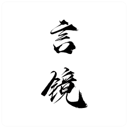

# Projekto
三朝（辽、金、[夏](https://github.com/teksto/tangut)）是一个有趣的时代，中原文明进入一个顶峰。大契丹国，大金，西夏都依靠汉字与音韵创立自身的文字。

最有趣的是这三国的文字都是向着汉字的形态发展，西夏文、契丹大字、女真大字都是以汉字为基础创制的表意字，而契丹、女真小字则是以汉字元素为基础的拼写文字。个人认为韩文的创制也在一定程度参考了两国小字的形式进行创制。

# Intenco

# Plano