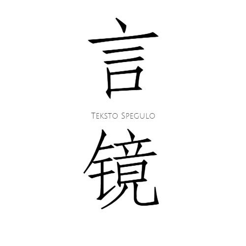

# 言鏡
煙塵散灰盡，破碑通古今，一筆橫折勾，鐵線織輿鏡。

# 那啥这个好像叫Flag……
本项目始于[群](#)·小萱姐姐[女装]的小卡片。

一期实现小程序。

二期计划基于小程序实现App，以及Web。

番外计划：制作特有的Unicode字体。

番外·续：把以前坑里留下的‘柳叶女书’完成。

## 支持语言
- [x] 西夏文
- [x] 辽字
- [x] 女真字
- [x] 女书
- [x] 八思巴

*以上为计划支持的小卡片功能。*

# 鸣谢
- [小萱姐姐[女装]](#)
- [Jerry：古今文字集成](http://ccamc.co/)